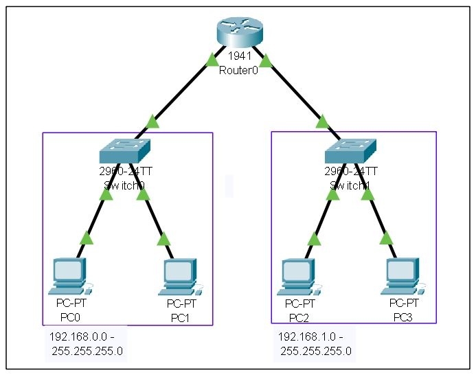
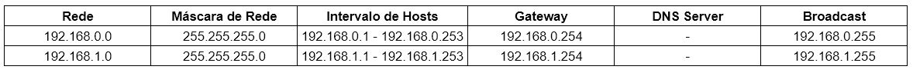

# Projeto de rede utilizando 1 roteador, 2 switchs e 4 PC - CISCO Packet Tracer

## Contextualização

Neste projeto fiz duas redes se conectarem através de um roteador, e cada rede teve sua distribução de hosts feitas através de um switch interno.
Foram introduzidos e aplicados os conceitos de iPv4, Redes, Máscaras de rede, Gateway, Broadcast e PDU.

## Lista dos componentes

- 1 Roteador 1941
- 2 Switchs 2960-24TT
- 4 PC-PT

## Projeto Lógico

## Tabela de endereçamento de IP

## Arquivo pkt

https://drive.google.com/file/d/12jmt3go3bHxDUdmULEAYZ_ezHsSYrj6t/view?usp=sharing

